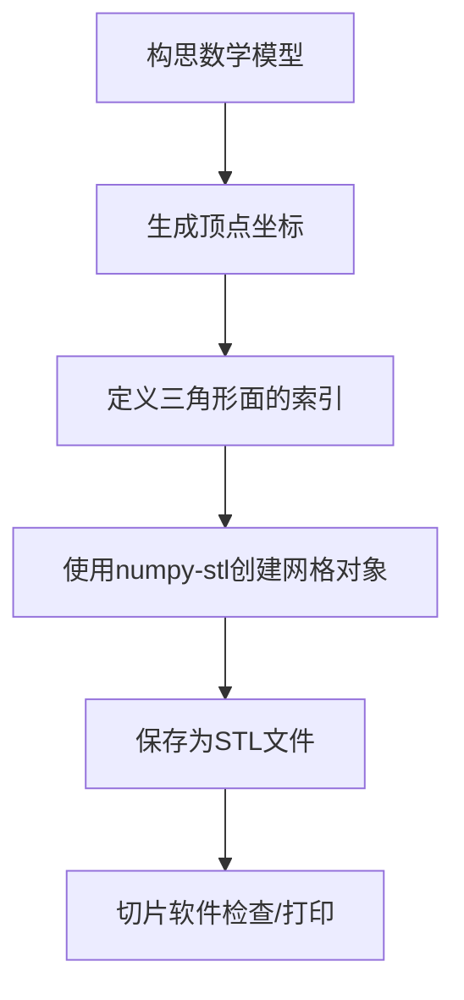

# 通过Python生成用于3D打印的STL文件

### 为什么选择 `numpy-stl`？

它是处理STL文件最直接的Python库之一，与NumPy紧密结合，能高效地创建和修改三维网格。它让你可以直接操作构成模型表面的一个个**三角形**，这是STL文件最底层的结构。

### 🛠️ 工作流概览



### 💻 动手实践：生成一个立方体STL文件

1. **安装库**：首先需要安装 `numpy-stl`。
   
   ```bash
   pip install numpy-stl
   ```

2. **编写Python代码**：这是生成一个位于原点、边长为2的立方体STL文件的完整代码。
   
   ```python
   import numpy as np
   from stl import mesh
   
   # 1. 定义8个顶点
   # 顺序：底面4个点（逆时针），顶面4个点（逆时针）
   vertices = np.array([
       [-1, -1, -1],  # 0: 底面 - 左后
       [ 1, -1, -1],  # 1: 底面 - 右后
       [ 1, -1,  1],  # 2: 底面 - 右前
       [-1, -1,  1],  # 3: 底面 - 左前
       [-1,  1, -1],  # 4: 顶面 - 左后
       [ 1,  1, -1],  # 5: 顶面 - 右后
       [ 1,  1,  1],  # 6: 顶面 - 右前
       [-1,  1,  1]   # 7: 顶面 - 左前
   ])
   
   # 2. 定义12个三角形面（每个面用3个顶点的索引表示）
   # 注意顶点顺序为逆时针，确保法线朝外
   faces = np.array([
       # 底面 (y = -1)
       [0, 3, 1],
       [1, 3, 2],
       # 顶面 (y = 1)
       [4, 5, 7],
       [7, 5, 6],
       # 左面 (x = -1)
       [0, 4, 3],
       [3, 4, 7],
       # 右面 (x = 1)
       [1, 2, 5],
       [5, 2, 6],
       # 后面 (z = -1)
       [0, 1, 4],
       [4, 1, 5],
       # 前面 (z = 1)
       [3, 7, 2],
       [2, 7, 6]
   ])
   
   # 3. 创建Mesh对象
   cube_mesh = mesh.Mesh(np.zeros(faces.shape[0], dtype=mesh.Mesh.dtype))
   for i, f in enumerate(faces):
       for j in range(3):
           cube_mesh.vectors[i][j] = vertices[f[j], :]
   
   # 4. 保存为STL文件
   cube_mesh.save('my_cube.stl')
   print("STL文件 'my_cube.stl' 已生成！")
   ```

### 📈 进阶思路：构建更复杂的几何体

* **复杂模型**：对于球体、椭球体等，核心思路是通过参数方程生成大量顶点，然后按规则将它们连接成三角形网格。例如，一个椭球体可以通过经度（θ）和纬度（φ）划分网格，每个网格单元由两个三角形组成。
* **避免手动定义**：对于成百上千的三角面，手动定义不现实。可以使用 `scipy.spatial.ConvexHull` 来自动计算一组点集的凸包，从而生成三角网格，这对处理凸形状非常方便。
* **确保打印质量**：
  * **法线方向**：三角形的顶点顺序必须是**逆时针**的，这样法线才会指向外部，否则模型在切片软件中可能显示为黑色或无法正确识别。
  * **模型流形性**：生成的模型必须是“水密”的，即没有漏洞、重叠或零厚度的面，才能被完美打印。这是3D建模的核心挑战之一。

### 📚 其他可选方法

除了 `numpy-stl`，还有一些库也提供不同的建模思路：

* **`trimesh`**：功能非常强大，除了创建，还能进行复杂的网格分析、修复和布尔运算。
* **`SolidPython`**：这是对OpenSCAD的Python封装。它让你能用Python代码进行CSG（构造实体几何）建模。不过，它的工作流是生成`.scad`文件，再依赖OpenSCAD软件将其导出为STL。

希望这个指南能帮你开始自己的3D建模之旅。如果你有特定形状的模型想生成（比如一个齿轮、一个花瓶，或是某个数学曲面），可以告诉我，我再提供更有针对性的指导。
