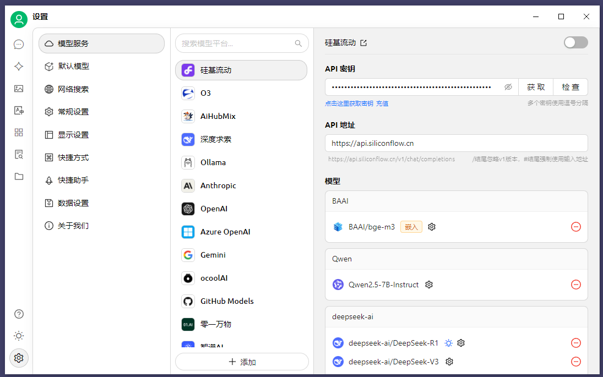

<<<<<<< HEAD
## Windows 系统下安装 Cherry Studio 的详细步骤

### 一、下载安装包

1. **访问官网**：打开浏览器，访问 Cherry Studio 的官网 [https://cherry-ai.com/download](https://cherry-ai.com/download)，选择适配 Windows 系统的版本进行下载。
2. **选择版本**：官网提供了最新版本和历史版本的下载选项，可根据需求选择。
3. **下载提示**：如果浏览器提示文件不被信任，选择“保留”即可。

### 二、安装软件

1. **运行安装包**：下载完成后，双击下载的 `.exe` 文件，启动安装向导。
2. **选择安装路径**：按照安装向导的提示，选择安装路径（建议选择默认路径，避免路径中包含空格或中文字符），并选择语言（默认为中文）。
3. **完成安装**：点击“下一步”，等待安装进度完成，安装完成后点击“完成”。

### 三、启动与初始设置

1. **启动软件**：安装完成后，可在开始菜单或桌面上找到 Cherry Studio 的快捷方式，点击启动。
2. **同意协议**：首次启动时，需同意用户协议，即可进入主界面。

### 四、配置 API 密钥（可选）

1. **获取 API 密钥**：如果需要使用特定的 AI 模型服务（如硅基流动、DeepSeek 等），需先在对应平台注册账号并获取 API 密钥。
   - 以硅基流动为例，访问 [https://cloud.siliconflow.cn](https://cloud.siliconflow.cn)，注册账号，进入用户中心，点击“API 密钥”，创建并复制密钥。
2. **配置密钥**：在 Cherry Studio 界面中，点击左下角的“设置”，找到“模型服务”，选择对应的模型提供商，输入 API 密钥并点击“检查”按钮，测试配置是否成功。

### 五、其他注意事项

- **系统要求**：Windows 7 系统不支持安装 Cherry Studio，建议使用 Windows 10 或更高版本。
- **安装路径**：安装路径中避免包含空格或中文字符，以免出现兼容性问题。

完成以上步骤后，即可开始使用 Cherry Studio 的各种功能，如多模型对话、文档处理等。
=======
## Windows 系统下安装 Cherry Studio 的详细步骤

### 一、下载安装包

1. **访问官网**：打开浏览器，访问 Cherry Studio 的官网 [https://cherry-ai.com/download](https://cherry-ai.com/download)，选择适配 Windows 系统的版本进行下载。
2. **选择版本**：官网提供了最新版本和历史版本的下载选项，可根据需求选择。
3. **下载提示**：如果浏览器提示文件不被信任，选择“保留”即可。

### 二、安装软件

1. **运行安装包**：下载完成后，双击下载的 `.exe` 文件，启动安装向导。
2. **选择安装路径**：按照安装向导的提示，选择安装路径（建议选择默认路径，避免路径中包含空格或中文字符），并选择语言（默认为中文）。
3. **完成安装**：点击“下一步”，等待安装进度完成，安装完成后点击“完成”。

### 三、启动与初始设置

1. **启动软件**：安装完成后，可在开始菜单或桌面上找到 Cherry Studio 的快捷方式，点击启动。
2. **同意协议**：首次启动时，需同意用户协议，即可进入主界面。

### 四、配置 API 密钥（可选）

1. **获取 API 密钥**：如果需要使用特定的 AI 模型服务（如硅基流动、DeepSeek 等），需先在对应平台注册账号并获取 API 密钥。
   - 以硅基流动为例，访问 [https://cloud.siliconflow.cn](https://cloud.siliconflow.cn)，注册账号，进入用户中心，点击“API 密钥”，创建并复制密钥。
2. **配置密钥**：在 Cherry Studio 界面中，点击左下角的“设置”，找到“模型服务”，选择对应的模型提供商，输入 API 密钥并点击“检查”按钮，测试配置是否成功。

### 五、其他注意事项

- **系统要求**：Windows 7 系统不支持安装 Cherry Studio，建议使用 Windows 10 或更高版本。
- **安装路径**：安装路径中避免包含空格或中文字符，以免出现兼容性问题。

完成以上步骤后，即可开始使用 Cherry Studio 的各种功能，如多模型对话、文档处理等。
>>>>>>> ee0de038a932e9888ffa0b60c04e3c6a89d7d464
