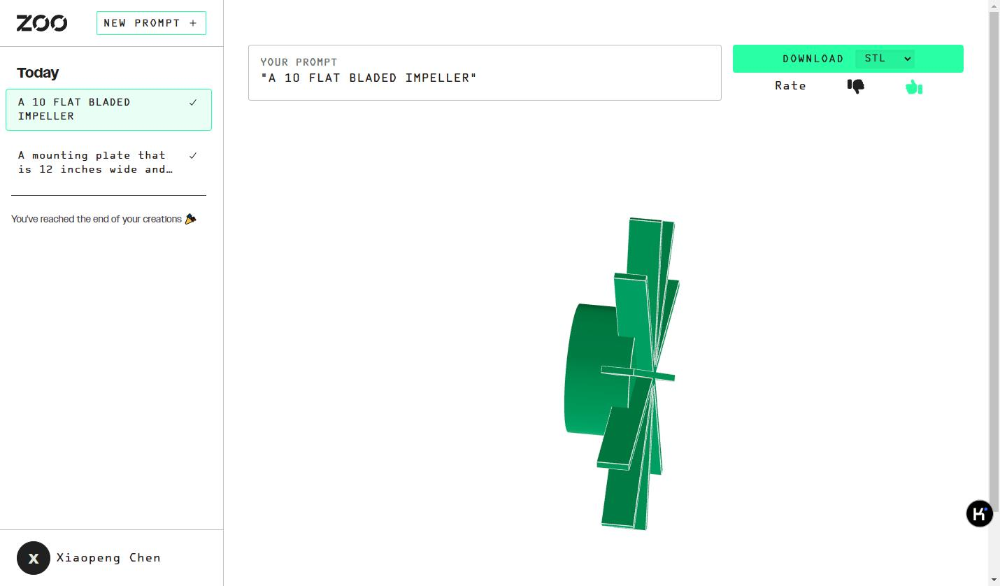
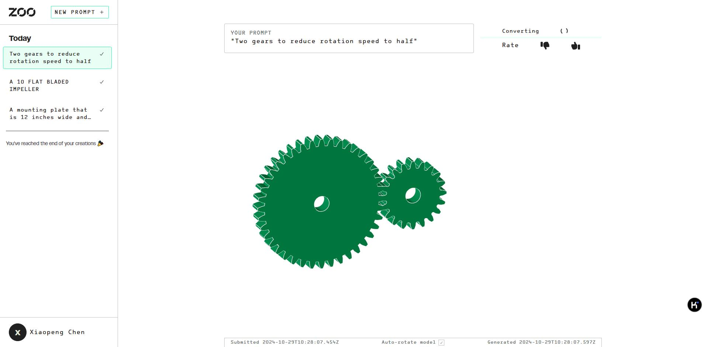

## Generate CAD from text prompts

[https://zoo.dev/text-to-cad](https://zoo.dev/text-to-cad)

#### AI CAD Model Generator - 创造未来的CAD文件**

欢迎来到Zoo，一个革命性的AI CAD模型生成器，它允许用户通过简单的文本提示来生成CAD文件。Zoo的Text-to-CAD功能是一个开源的提示界面，它利用我们的Design API和Machine Learning API，通过程序化分析训练数据来生成CAD文件，从而将你的想法快速转化为复杂的机械设计。

**核心功能：**

- **文本到CAD的转换：** 通过输入文本提示，如“一个10片平直的叶轮”、“一个36齿的螺旋齿轮”或“一个五角星”，Text-to-CAD能够生成相应的CAD模型，这些模型可以被导入到你选择的任何CAD程序中。

- **定制化模型生成：** 利用我们的机器学习技术，Text-to-CAD能够根据你的特定需求生成定制化的CAD模型。

- **数据集微调：** 你可以对我们的机器学习模型进行微调，以快速利用你的现有数据创建专门的Text-to-CAD生成器，无需构建和维护基础设施。预计在2024年，你将能够基于你自己的专有数据集进行Text-to-CAD的微调，并独家使用。

**如何开始使用Text-to-CAD：**

- 访问我们的网站，开始你的CAD模型生成之旅。
- 加入我们的硬件设计社区，与其他设计师和工程师保持联系，共同推动创新。

Zoo致力于通过AI技术简化设计流程，提高效率，让设计师和工程师能够更快地将创意变为现实。加入我们，一起探索AI在CAD设计中的无限可能。

---
