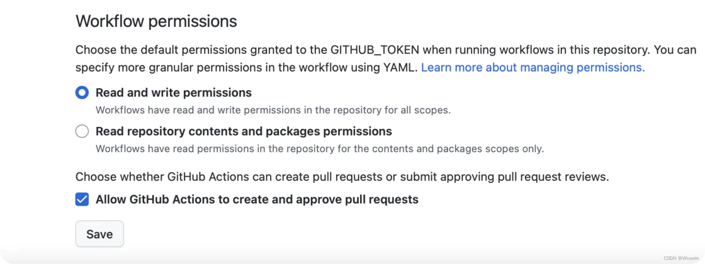
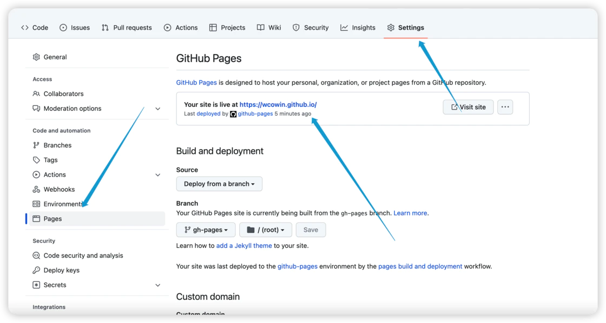

# 拥抱 Zensical新一代静态站点实战

## **为什么值得从 Material for MkDocs 看向 Zensical？**

先说结论：如果你正在搭建一个**以内容为中心的个人博客 / 文档站**，而且不排斥命令行，那么现在开始用 Zensical 已经是一个足够稳妥的选择。

### **01. 官方视角：Material for MkDocs 进入维护期，Zensical 接棒博客场景**

在 Zensical 官方博客中有一句话非常关键：

> Material for MkDocs 继续维护，但新功能基本不会再增加；博客场景推荐使用 Zensical。

这意味着：

- **MkDocs 更像是「稳定基建」**：适合企业内网、技术规格说明这类「写好就不常改」的文档。
- **Zensical 则更像「为个人写作者优化的新版博客系统」**：内置文章列表、标签、归档这套博客习惯的功能，导航与切页体验也更接近现代博客。

### **02. 用户视角：Zensical 带来的几个明显变化**

结合我自己的使用体验，总结下来有几个明显的感受：

**浏览体验：真正的「即时导航」**  
文档之间切换不再整页刷新，而是类似 SPA 的即时切换，左侧目录、顶部导航都可以保持状态，让阅读更连续。

**写作心智：不再为「是不是博客」纠结**  
以前用 MkDocs 写博客，总有点「文档系统写博客」的错位感；Zensical 从一开始就把「博客」放进设计里，不用再靠一堆插件堆出来。

**性能与现代性：Rust 运行时 + 更现代的设计**  
构建速度与前端交互都更顺滑，底层使用 Rust，也为后面一些进阶能力（如更复杂的静态生成逻辑）留下空间。

**配置方式：从 YAML 到 TOML，更友好一点**  
如果你习惯写 `pyproject.toml`，那上手 `zensical.toml` 几乎没有学习成本。

一句话概括：**如果你现在打算新建一个内容站点，用 Zensical 是一个更「面向未来」的决定。**

## **环境准备：5 分钟把 Zensical 跑起来**

Zensical 本质上是一个 Python 包，所以只要有 Python 3.10+ 环境，就可以装起来跑。

### **1. 创建目录 & 虚拟环境**

假设你打算新建一个博客项目：

Shell复制

```shell
mkdir my-zensical-blog
cd my-zensical-blog

python3 -m venv .venv
source .venv/bin/activate   # Windows: .venv\Scripts\activate
```

为什么推荐用虚拟环境？

- **不会和系统里其他 Python 项目的依赖打架**
- 后续迁移、备份、CI 部署都更清晰

### **2. 安装 Zensical**

Shell复制

```shell
pip install zensical
```

如果你想完全跟随《Zensical 中文教程》的依赖版本，也可以直接 clone 教程仓库：

Shell复制

```shell
git clone https://github.com/Wcowin/Zensical-Chinese-Tutorial.git
cd Zensical-Chinese-Tutorial
pip install -r requirements.txt
```

### **3. 一条命令初始化站点骨架**

在一个**空目录**里执行：

Shell复制

```shell
zensical new .
```

Zensical 会自动生成一套最小可用的项目结构，包括：

- `docs/`：存放所有 Markdown 文档
- `zensical.toml`：核心配置文件
- 若干示例页面与配置

如果你熟悉 MkDocs，可以把 `docs/` 理解为原来的 `docs` 目录，而 `zensical.toml` 相当于更现代版的 `mkdocs.yml`。

### **4. 配置站点（必需）**

在启动预览前，需要编辑 `zensical.toml` 设置 `site_name`（唯一必需的配置项）：

Shell复制

```shell
[project]
site_name = "我的 Zensical 博客"
```

如需启用即时导航、即时预览等功能，建议同时设置 `site_url`（详见 [官方文档](https://sspai.com/link?target=https%3A%2F%2Fzensical.org%2Fdocs%2Fcreate-your-site%2F)）。

### **5. 本地预览**

Shell复制

```shell
zensical serve
```

默认会启动在 `http://localhost:8000`，打开浏览器你就能看到一个已经成型的站点——带导航、带主题、带基本文案的那种，而不是「纯白 Hello World」。

## **项目结构：Zensical 的「默认约定」是怎样的？**

如果你是习惯整理项目结构的人，这一节很关键。

以《Zensical 中文教程》为例，大致结构如下：

代码块复制

```plaintext
├── docs/                  # 所有文档源文件
│   ├── index.md           # 首页
│   ├── getting-started/   # 快速开始
│   ├── tutorials/         # 核心教程
│   └── blog/              # 博客/部署/高级主题等
├── zensical.toml          # 站点配置
└── requirements.txt       # Python 依赖列表
```

- `**docs/index.md**`：就是你站点的首页，可以放一句标语、一些导航卡片、推荐阅读路径等。
- `**getting-started/**`：适合作为「快速开始 / 安装配置」的集中入口。
- `**tutorials/**`：放长篇教程、分专题的内容。
- `**blog/**`：根据需要拆分为 `deployment`、`advanced`、`plugins` 等子目录。

你完全可以按自己的写作习惯调整，只要在 `zensical.toml` 里正确配置导航即可。

## **写下第一篇文章：从 Markdown 到完整页面**

### **1. 新建一篇 Markdown**

假设你想写一篇《从 Material for MkDocs 迁移到 Zensical》的文章，在 `docs/blog/` 下新建：

Shell复制

```shell
mkdir -p docs/blog
touch docs/blog/migrate-from-mkdocs.md
```

内容可以像这样开始：

Markdown复制

```markdown
---
title: 从 Material for MkDocs 迁移到 Zensical
date: 2026-02-25
tags:
  - Zensical
  - Material for MkDocs
  - 博客搭建

---  

# 从 Material for MkDocs 迁移到 Zensical

这里简单介绍一下为什么要迁移、适合谁、整体思路……
```

这里的 Front Matter（上面那块 `---`）用于告诉 Zensical：

- 文章标题
- 发布时间
- 标签等元信息

### **2. 把它挂到导航里**

编辑 `zensical.toml`，添加导航配置。完整的导航配置示例：

代码块复制

```htmlembedded
nav = [
  { "首页" = "index.md" },
  { "迁移指南" = "blog/migrate-from-mkdocs.md" },
]
```

Zensical 会根据你的 `docs/` 目录结构和文章元数据，自动生成博客列表页和详情页。你要做的只是：

- 确保文章存在于 `docs/` 里
- 元信息填写合理（尤其是 `date`）

刷新本地预览，你就能看到这篇新文章已经出现了。

## **主题与外观：如何让它"看起来像你自己"**

Zensical 内置了现代感较强的主题，同时也保留了足够多的定制点。真正让站点"变成你自己的"，核心在于 `zensical.toml` 中的两个配置项：`**extra_css**` 和 `**extra_javascript**`。

### **1. 核心配置：extra_css 与 extra_javascript**

这两个数组是注入自定义样式的**正规入口**。本站的实际配置如下：

代码块复制

```
[project]
# ===== 额外的 JavaScript 文件 =====
extra_javascript = [
    "javascripts/extra.js",                              # 自定义脚本
    "javascripts/github-heatmap.js",                     # GitHub 贡献热力图
    "javascripts/github-repo-card.js",                   # GitHub 仓库卡片
    "https://unpkg.com/katex@0/dist/katex.min.js",       # KaTeX 数学公式（CDN）
    "https://unpkg.com/katex@0/dist/contrib/auto-render.min.js",
    "javascripts/katex.js"                               # KaTeX 配置
]

# ===== 额外的 CSS 文件 =====
extra_css = [
    "stylesheets/extra.css",           # 自定义样式
    "stylesheets/ziti.css",            # 字体样式
    "stylesheets/github-widgets.css",  # GitHub 组件样式
    "https://unpkg.com/katex@0/dist/katex.min.css"  # KaTeX 样式（CDN）
]
```

**关键点：**

- **本地文件**：路径相对于 `docs_dir`（默认是 `docs/`），所以 `stylesheets/extra.css` 实际位置是 `docs/stylesheets/extra.css`
- **CDN 资源**：直接写完整 URL，如 `https://unpkg.com/katex@0/dist/katex.min.css`
- **加载顺序**：数组顺序即加载顺序，依赖关系要注意（如 KaTeX 先加载核心库，再加载插件）

### **2. 主题特性开关：features 配置**

除了注入自定义样式，另一个重要的定制入口是 `[project.theme]` 下的 `features` 数组。它控制着站点的各种交互功能开关：

代码块复制

```
[project.theme]
features = [
    # 导航相关
    "navigation.tabs",            # 一级导航显示为顶部 Tab
    "navigation.sections",        # 侧边栏分组
    "navigation.top",             # 返回顶部按钮
    "navigation.footer",          # 上一页/下一页导航
    "navigation.instant",         # 即时导航（SPA 体验）

    # 搜索相关
    "search.suggest",             # 搜索建议
    "search.highlight",           # 搜索结果高亮

    # 内容相关
    "content.code.copy",          # 代码复制按钮
    "content.code.annotate",      # 代码注释功能
]
```

**常用特性说明：**

| **特性**               | **作用**            |
| -------------------- | ----------------- |
| `navigation.instant` | 页面切换不刷新，类似 SPA 体验 |
| `navigation.tabs`    | 一级导航变成顶部 Tab 栏    |
| `navigation.top`     | 滚动后出现"返回顶部"按钮     |
| `search.suggest`     | 搜索时自动补全建议         |
| `content.code.copy`  | 代码块右上角添加复制按钮      |

这些特性可以按需开启，不需要的注释掉或删除即可。完整特性列表见 [官方文档](https://sspai.com/link?target=https%3A%2F%2Fzensical.org%2Fdocs%2Ffeatures%2F)。

### **3. 自定义 CSS：从配色到字体**

创建 `docs/stylesheets/extra.css`，你可以覆盖主题的任何样式。本站的示例：

Css复制

```css
/* 覆盖主色调 */
:root>* {
    --md-primary-fg-color: #518FC1;
}

/* 移除链接下划线 */
.md-typeset a {
    text-decoration: none;
}

/* 卡片阴影效果 */
.md-typeset .grid.cards>ul>li {
    border-radius: 0.7rem;
    box-shadow: 0 4px 8px rgba(0, 0, 0, 0.2);
    transition: box-shadow 0.25s;
}
```

**字体定制**（`docs/stylesheets/ziti.css`）：

Css复制

```css
@import url('https://fontsapi.zeoseven.com/292/main/result.css');
body {
    font-family: "LXGW WenKai";  /* 霞鹜文楷 */
}
```

### **3. 自定义 JavaScript：增强交互能力**

创建 `docs/javascripts/extra.js`，可以添加各种交互功能。基础模板：

Javascript复制

```javascript
// 即时导航兼容（Zensical 特有）
document$.subscribe(function() {
    console.log('页面加载完成');
    // 在这里添加你的自定义逻辑
});
```

更高级的用法包括：

- **GitHub 贡献热力图**：`github-heatmap.js` 在页面中渲染 GitHub 风格的贡献图
- **数学公式渲染**：通过 KaTeX 让 `$$E=mc^2$$` 正确显示
- **评论系统集成**：接入 Waline、Giscus 等第三方服务

### **4. 页面内联样式：临时微调**

如果只是某个页面需要微调，可以直接在 Markdown 里写 `<style>` 标签：

代码块复制

```htmlembedded
<style>
.custom-font {    font-size: 31px;    color: #757575;}
</style>
```

这种方式适合**一次性调整**，系统级的样式还是应该放到 `extra.css` 中管理。

**总结**：主题定制的正确姿势是——先用 `extra_css` 和 `extra_javascript` 做系统化配置，再用页面内联样式做局部微调。这样既保持代码整洁，又方便后续维护。

## **部署：从本地到 GitHub Pages 的一键上线**

本地预览顺手之后，下一步就是把站点放到互联网上。《Zensical 中文教程》当前推荐的主流方案是 **GitHub Pages**，不用自己配服务器，对个人博客非常友好。

### **1. 生成静态文件**

在项目根目录执行：

Shell复制

```shell
zensical build --clean
```

- `build` 会根据 `docs/` 和 `zensical.toml` 生成最终的静态站点
- `--clean` 会在构建前清理旧的输出，避免遗留文件干扰

构建完成后，会得到一个类似 `site/` 的目录，里面就是可以直接丢到任意静态托管平台上的纯静态文件。

### **2. 使用 GitHub Pages 托管（推荐）**

下面给一个**可以直接照抄的最小实践流程**，假设你已经在本地把 Zensical 跑起来了。

**在 GitHub 新建仓库**

- 登录 GitHub，点击「New」创建一个公开仓库，例如 `my-zensical-blog`
- 不要初始化 README（本地已有项目）
- Github仓库setings/Actions/General 勾选这两项：



**把本地项目推到 GitHub**

Shell复制

```shell
git init
git add .
git commit -m "chore: init zensical site"
git branch -M main
git remote add origin git@github.com:<你的用户名>/my-zensical-blog.git
git push -u origin main
```

1. **在仓库里添加 GitHub Actions 工作流**

在项目根目录新建 `.github/workflows/docs.yml`：

Yaml复制

```
name: Documentation
on:
  push:
    branches:
      - master
      - main
permissions:
  contents: read
  pages: write
  id-token: write
jobs:
  deploy:
    environment:
      name: github-pages
      url: ${{ steps.deployment.outputs.page_url }}
    runs-on: ubuntu-latest
    steps:
      - uses: actions/configure-pages@v5
      - uses: actions/checkout@v5
      - uses: actions/setup-python@v5
        with:
          python-version: 3.x
      - run: pip install zensical
      - run: zensical build --clean 
      - uses: actions/upload-pages-artifact@v4
        with:
          path: site
      - uses: actions/deploy-pages@v4
        id: deployment
```

提交并推送：

Shell复制

```shell
git add .github/workflows/docs.yml
git commit -m "chore: add github pages workflow"
git push
```

1. **在 GitHub 页面中开启 Pages**
- 打开仓库 → 「Settings」→ 左侧「Pages」
- 在「Build and deployment」里选择：
  - Source：`GitHub Actions`
- 保存后，等工作流跑完，大概几分钟内就能拿到一个 `https://<用户名>.github.io/my-zensical-blog/` 的访问地址。



到这一步，一个完整可访问的 Zensical 站点就上线了。之后你只需要：

- 在本地修改/新增 Markdown 内容
- `git commit && git push`

GitHub Actions 会自动重新构建并部署最新内容。

如果你喜欢 Netlify、EdgeOne Pages、GitLab Pages 等平台，[《Zensical 中文教程](https://sspai.com/link?target=https%3A%2F%2Fwcowin.work%2FZensical-Chinese-Tutorial%2F)》中也有对应的部署指南，可以按自己喜好选择。

## **从 Material for MkDocs 迁移：痛点、坑点与实战建议**

如果你已经有一个运行多年的 Material for MkDocs 站点，直接换工具肯定会担心「迁移成本」。好消息是：

**大部分 Markdown 内容可以直接拷贝过来**  
只要不是太依赖某些特定插件语法，Zensical 会原样渲染。

**需要重点调整的是：配置与导航**  
`mkdocs.yml` → `zensical.toml`，语法和字段名称会有变化，这一块可以直接对照《从 Material for MkDocs 迁移》那篇教程，一步一步改。

**个别高级特性需要重新思考**  
比如自定义 hooks、复杂导航逻辑等，需要用 Zensical 的方式重做一遍，这也是我在迁移过程中花时间最多的地方。

我的个人建议是：

1. **优先保证「能跑起来」**：先按最小配置，让原有内容在 Zensical 下正常访问。
2. **再慢慢迁移「样式与交互」**：比如首页布局、代码高亮、搜索等。
3. **最后再处理「复杂定制」**：例如自定义脚本、高级交互等。

## **进阶玩法：性能、SEO、多语言与评论系统**

当你用 Zensical 写了一段时间，站点慢慢长大时，可以考虑一些进阶能力：

- **性能优化**：减少不必要的脚本与资源、调整构建策略，让首屏更快。
- **SEO 设置**：合理配置站点标题、描述、Open Graph 等，方便在搜索引擎和社交媒体里展示。
- **多语言支持**：为文档/博客添加多语言版本，适合有中英双语需求的创作者。
- **评论系统**：集成你喜欢的评论组件（如 Waline、Giscus 等），在不失去静态站点优势的前提下，引入基本的互动。

这些内容在[教程](https://sspai.com/link?target=https%3A%2F%2Fwcowin.work%2FZensical-Chinese-Tutorial%2F)的「高级主题」部分都有对应的文章，可以根据自己的需求挑着看。

## **写在最后：为什么我会长期选择 Zensical？**

我自己的判断主要来自三点：

- **生态动向**：Material for MkDocs 进入维护期，而 Zensical 刚刚起步，官方和社区的注意力会更多集中在后者。
- **个人体验**：在日常写作和维护中，Zensical 带来的即时导航、博客系统、一致的配置体验，确实减少了我在配置工具上的时间。
- **中文资料与实践**：我已经把自己踩过的坑、实践过的方案整理成了一个完整的中文教程站，未来也会持续跟进官方更新。

如果你正在为「下一站用什么搭博客」犹豫，不妨找一个晚上，按照文中的步骤跑一遍 Zensical，写一篇小文章部署到 GitHub Pages——大概一个小时之内你就能感受到它和 Material for MkDocs 的差异。

## **延伸阅读与资源**

- **Zensical 官方文档**：[zensical.org/docs](https://sspai.com/link?target=https%3A%2F%2Fzensical.org%2Fdocs%2Fget-started%2F)
- **Zensical 中文教程（示例仓库）**：[github.com/Wcowin/Zensical-Chinese-Tutorial](https://sspai.com/link?target=https%3A%2F%2Fgithub.com%2FWcowin%2FZensical-Chinese-Tutorial)
- **Zensical 在线阅读教程站点（推荐）**：[wcowin.work/Zensical-Chinese-Tutorial](https://sspai.com/link?target=https%3A%2F%2Fwcowin.work%2FZensical-Chinese-Tutorial%2F)
- **个人博客**：[https://wcowin.work/](https://sspai.com/link?target=https%3A%2F%2Fwcowin.work%2F)
