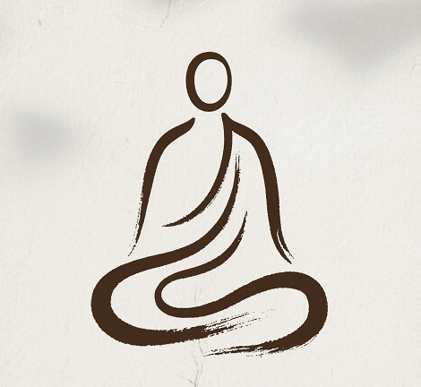

**

```

    用最精炼的视觉语言，勾勒出一个能容纳无限精神内涵的禅意符号。

    少即是多的典范之作。 它摒弃了一切冗余细节，将形象高度抽象为一条充满呼吸感的线条，
    从而直达冥想，内观的精神本质。

    线条：有生命力的一笔画。

    细节：人物由一条连贯、流畅的墨线一气呵成。线条并非机械的均匀，而是带有微妙的粗细变化和
    手绘的质感，一个充满禅意的打坐元素Logo，适合用于表达宁静、内省与和谐主题的场合。绝对的
    居中与对称，营造出一种超越时间的永恒感和内在的秩序感。

    细节：深褐（或黑）与浅米白的对比柔和而坚定。背景的做旧质感与轻微晕影，如同古纸或历经岁
    月的墙面，为极简的画面注入了手作的温暖感和历史感。

    意蕴：大量的留白，简洁线条：整体设计采用极简主义风格，通过流畅的线条勾勒出人物形象，传
    达出一种简约而不简单的美感。
    
```