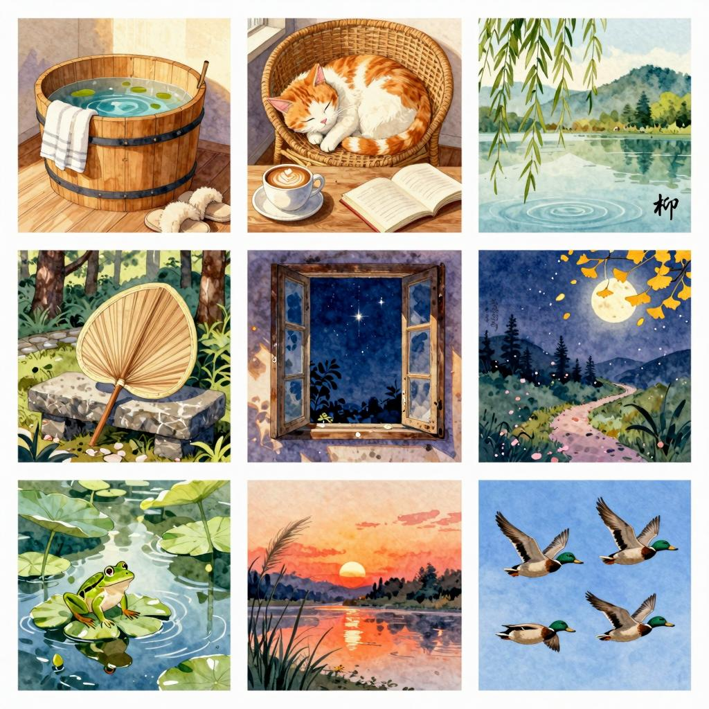

## 《我喜欢》

<!-- controls 属性用于显示播放暂停等控件 -->

<audio controls src="/www/sounds/墨缘.mp3"></audio>

我喜欢 

暖冬的泡脚桶， 

我喜欢 

初春的柳枝条， 

我喜欢 

午后的咖啡和一只发呆的猫咪。 

我喜欢 

仲夏的蒲扇， 

我喜欢 

清秋的明月 

我说，你看 

你就看着回答说：今天的月亮好美。 

--- 

我喜欢 

小窗外的夜空， 

夜空中的那颗星星。 

我喜欢 

雨后的青蛙 

我喜欢 

山前的杏花。 
我喜欢， 
周三傍晚被霞光亲吻的溪水。 

我喜欢 

成群的野鸭， 

我喜欢 

凌乱的书架， 

清风的露台， 

远处的灯海。 

--- 

我喜欢 

楼下深夜开张的花房 
我喜欢 

魏卷卷那童趣的头发， 

我喜欢 

无尽田野上奔跑的麋鹿， 

我喜欢 

奶奶门前的那棵榕树。 

我喜欢 

母亲的早餐， 

我喜欢 

父亲的胡渣。 
我喜欢 

七月今天的夜晚， 

我喜欢 

门厅挂落的铃铛。 

我喜欢 

停电的夜晚， 

那样，我就可以点一排蜡烛， 

在清朗的阳台上，倒上两杯酒。 

--- 

我喜欢 
城市尽头，那远远的青山。 
我喜欢 

热气球飞上西边的天空 
我喜欢 
清晨楼下的跑道， 

雾腾腾的早餐店， 

热乎乎的大麻球 
我喜欢，你应该也知道 
